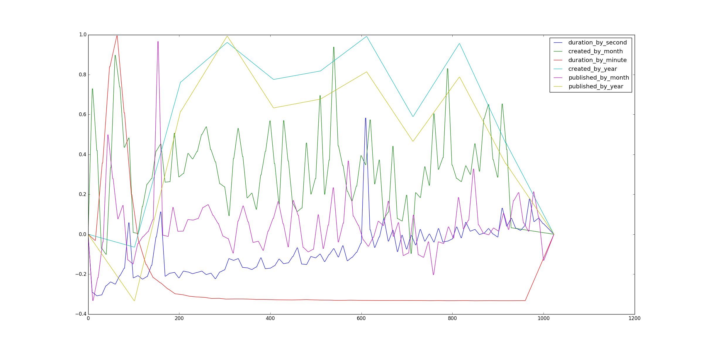

# 100k Wavetables

To celebrate 100,000 published tracks on the Free Music Archive, 
we've put together some data that we hope you will use for 
creative purposes!

In the `wavetables` directory you will find a set of wavetables 
created using the data from the first 100k tracks.

The wavetables labeled "1024" are linearly interpolated from the 
original data to be 1024 samples long, and the wavetables labeled "o" 
have only the original values from the dataset -- which might be handy if you 
want to try other interpolation schemes, or just use the raw data itself. 
All wavetables are mono 16bit/44.1k WAV files.
